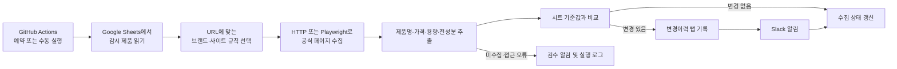

# 화장품 공식 상품 상세 페이지 변경 감시 자동화 파이프라인

## 1. 문서 목적

이 문서는 화장품 공식 상품 상세 페이지에서 제품 정보를 정기적으로 수집하고, Google Sheets에 저장된 기준값과 비교해 변경 사항을 기록하고 Slack으로 알리는 자동화 파이프라인을 설명한다.

감시 대상은 다음 네 항목이다.

| 항목 | 비교 기준 |
|---|---|
| 제품명 | Google Sheets의 `제품명`과 공식 페이지의 상품명 |
| 가격 | Google Sheets의 `가격(원)`과 공식 페이지의 할인 전 기본 판매가 |
| 용량 | Google Sheets의 `용량`과 공식 페이지의 ml 용량 |
| 전성분 | Google Sheets의 `전성분`과 공식 페이지에 공개된 전성분 및 표기 순서 |

변경이 확인되어도 제품 데이터 원본은 자동으로 수정하지 않는다. 파이프라인은 변경 내역만 기록하고 담당자에게 알리며, 관련 데이터는 담당자가 검토한 뒤 수동으로 수정한다.

## 2. 전체 구조



구성 요소별 역할은 다음과 같다.

| 구성 요소 | 역할 |
|---|---|
| Google Sheets | 감시 대상과 사람이 관리하는 현재 기준값 저장 |
| `sites.yaml` | 브랜드·공식 사이트별 URL 및 추출 규칙 정의 |
| `vion_monitor/extract.py` | HTML, JSON-LD, 상품정보 표에서 값 추출 및 정규화 |
| `vion_monitor/compare.py` | 시트 기준값과 공식 페이지 수집값 비교 |
| `vion_monitor/sheets.py` | Sheets 조회, 수집 상태 및 변경이력 기록 |
| `vion_monitor/__main__.py` | 전체 수집·비교·기록·알림 흐름 제어 |
| `vion_monitor/probe.py` | 운영 반영 전 읽기 전용 수집 검증 보고서 생성 |
| GitHub Actions | 예약 실행, 수동 실행, 테스트, 결과물 보관 |
| Slack Incoming Webhook | 변경 및 수집 오류 알림 전송 |

## 3. Google Sheets 구조

기본 제품 탭 이름은 `제품 데이터`이다. 다른 이름을 사용할 경우 GitHub Actions 변수 `PRODUCT_SHEET_NAME`에 실제 탭 이름을 등록한다.

제품 탭에는 다음 열이 필요하다.

| 열 | 설명 |
|---|---|
| `제품 ID` | 제품을 식별하는 고유값 |
| `제품명` | 사람이 관리하는 현재 제품명 |
| `가격(원)` | 할인·쿠폰을 제외한 기준 가격 |
| `브랜드명` | 제품 브랜드 |
| `용량` | ml 단위 숫자. 예: `300` |
| `전성분` | 쉼표로 구분된 현재 전성분 |
| `공식 상품 상세` | 감시할 공식 상품 상세 URL |

파이프라인은 최초 본 실행 시 다음 보조 탭을 자동으로 생성한다.

| 탭 | 용도 |
|---|---|
| `수집상태` | 제품별 최근 수집값과 이미 알린 차이 저장 |
| `실행설정` | 마지막 실행 시각 등 실행 상태 저장 |
| `변경이력` | 변경 시각, 제품, 항목, 이전값, 새 값, 공식 URL 기록 |

`제품 데이터` 탭은 파이프라인이 자동 수정하지 않는다. 담당자가 Slack 알림과 공식 페이지를 확인한 뒤 직접 수정한다.

## 4. 브랜드·사이트별 추출 방식

공식몰마다 HTML 구조와 쇼핑몰 엔진이 다르므로 하나의 공통 CSS 선택자로 모든 사이트를 처리하지 않는다. `sites.yaml`에서 공식 사이트별 규칙을 분리하고, 공통 엔진 규칙과 사이트 전용 규칙을 함께 사용한다.

지원하는 공통 쇼핑몰 엔진은 다음과 같다.

- `cafe24`
- `godomall`
- `makeshop`
- `custom`

각 사이트 규칙에는 다음 내용을 설정할 수 있다.

```yaml
sites:
  example_brand:
    domains: [example.com]
    paths: [/product/]
    engine: cafe24
    name: ['.product-name']
    regular_price: ['.consumer-price']
    base_price: ['#span_product_price_text']
    volume: ['.product-volume']
    ingredients: ['.ingredient-list']
    ingredient_labels: ['전성분', '모든 원료성분']
    render: true
```

규칙의 의미는 다음과 같다.

| 속성 | 설명 |
|---|---|
| `domains`, `paths` | 제품 URL이 어느 사이트 규칙에 속하는지 판정 |
| `engine` | 쇼핑몰 엔진의 공통 선택자 사용 |
| `name` | 제품명 전용 CSS 선택자 |
| `regular_price` | 정상가·소비자가 선택자 |
| `base_price` | 기본 판매가 선택자 |
| `volume` | 용량 선택자 |
| `ingredients` | 전성분 선택자 |
| `ingredient_labels` | 상품정보 표에서 성분 행을 찾을 때 사용할 제목 |
| `render` | JavaScript 실행 후 값이 나타나는 사이트에서 Playwright 사용 |

추출 순서는 사이트 전용 선택자, 상품정보 표, JSON-LD와 같은 구조화 데이터, 쇼핑몰 엔진 공통 규칙 순으로 적용한다. 관련 상품이나 메뉴의 가격·제품명을 본 상품 값으로 잘못 인식하지 않도록 제품 영역 안의 값과 공식 상품 구조화 데이터를 우선한다.

새 브랜드를 추가할 때는 공식 URL의 도메인과 경로, 페이지의 상품명·가격·용량·성분 위치를 확인해 `sites.yaml`에 독립된 규칙을 추가한다. 같은 쇼핑몰 엔진을 사용하더라도 사이트별 커스텀 테마가 다르면 전용 선택자를 추가한다.

## 5. 필드별 판정 규칙

### 제품명

공식 페이지의 대표 상품명을 수집한다. 비교할 때 브랜드명 접두어와 제품명에 포함된 용량 표기는 별도로 정규화한다. 용량 변화는 `용량` 항목에서 독립적으로 판단한다.

공식 페이지가 다른 제품으로 이동했거나 추출된 이름이 시트 제품명과 현저히 다르면 자동 변경으로 확정하지 않고 동일 제품 여부를 검수 대상으로 분류한다.

### 가격

가격은 할인 행사, 쿠폰, 회원 전용 가격, 최대 혜택가를 제외한 기본 가격을 사용한다. 페이지에 정상가·소비자가가 명시되어 있으면 해당 값을 우선하고, 별도 정상가가 없으면 기본 판매가를 사용한다.

할인가만 확인되고 기본 가격을 신뢰할 수 없으면 가격을 추측하지 않고 `미수집`으로 분류한다.

### 용량

시트의 숫자는 ml로 해석한다. 예를 들어 시트의 `300`은 `300ml`이다. 페이지의 L 표기는 ml로 환산할 수 있다.

페이지가 g 또는 kg으로만 표기된 경우 밀도를 알 수 없으므로 ml로 자동 환산하지 않는다. 이 경우 `용량 단위 확인 필요`로 분류해 담당자가 검토한다.

### 전성분

전성분은 다음 위치를 순서대로 확인한다.

1. 상품정보 표의 `전성분`, `모든 성분`, `모든 원료성분` 항목
2. 사이트별 전성분 CSS 선택자
3. 제품 JSON-LD의 성분 속성
4. JavaScript 실행 후 생성되는 전성분 영역
5. 상세 이미지에 포함된 상품정보고시 또는 전성분 표

문자열은 공백과 유니코드 표기를 정규화한 뒤 성분 목록으로 비교한다. `1,2-헥산다이올`과 `5,000ppm` 내부의 쉼표는 성분 구분자로 처리하지 않는다. 성분 추가·삭제와 표기 순서 변경을 구분한다.

공식 페이지가 영문 성분만 제공하고 시트가 한글인 경우 임의 번역이나 동의어 변환을 하지 않는다. 이 경우 자동 변경 판정을 보류하고 표기 언어 확인 대상으로 알린다.

상세 이미지에서 성분표가 확인되는 경우에는 이미지 URL을 검증 보고서에 기록한다. OCR 결과는 오탈자 가능성이 있으므로 자동 비교 기준으로 바로 사용하지 않고 검수 근거로 사용한다.

## 6. 실행 및 변경 처리 흐름

본 실행은 다음 순서로 진행된다.

1. Google Sheets에서 제품 목록과 네 가지 기준값을 읽는다.
2. `공식 상품 상세` URL이 있는 제품만 감시 대상으로 선택한다.
3. URL의 도메인과 경로로 브랜드·사이트 규칙을 선택한다.
4. 정적 HTTP 요청을 먼저 사용하고, 필요한 사이트는 Playwright로 렌더링한다.
5. 제품명·가격·용량·전성분을 추출하고 정규화한다.
6. 각 값을 현재 시트 값과 비교한다.
7. 변경이 있으면 `변경이력` 탭에 먼저 기록한다.
8. Slack으로 제품 ID, 제품명, 변경 항목, 이전값, 새 값, 공식 URL을 알린다.
9. 같은 차이를 매 실행마다 반복 알림하지 않도록 `수집상태`에 알림 상태를 저장한다.
10. 담당자가 시트 값을 수정하면 해당 차이는 해소된 것으로 처리한다.

일부 항목을 수집하지 못해도 다른 정상 수집 항목의 비교는 계속한다. `None`이나 추출 실패를 제품 변경으로 판단하지 않는다.

## 7. GitHub Actions 설정

저장소의 **Settings → Secrets and variables → Actions**에 다음 값을 등록한다.

| 종류 | 이름 | 값 |
|---|---|---|
| Secret | `GOOGLE_SERVICE_ACCOUNT_JSON` | Google 서비스 계정 JSON 전체 내용 |
| Secret | `GOOGLE_SPREADSHEET_ID` | Sheets URL의 `/d/`와 `/edit` 사이 ID |
| Secret | `SLACK_WEBHOOK_URL` | Slack Incoming Webhook URL |
| Variable | `PRODUCT_SHEET_NAME` | 선택 사항. 기본값은 `제품 데이터` |

서비스 계정 이메일에는 대상 Google Sheets의 편집자 권한을 부여한다. JSON 키와 Slack Webhook URL은 저장소 파일이나 로그에 기록하지 않는다.

워크플로는 다음 작업을 자동으로 수행한다.

1. 저장소 체크아웃
2. Python 및 패키지 설치
3. 단위 테스트 실행
4. Playwright Chromium 설치
5. `probe` 또는 본 모니터링 실행
6. `probe` 보고서와 근거 파일을 Artifact로 보관

동시 실행은 하나로 제한해 여러 실행이 같은 시트 상태를 동시에 수정하지 않도록 한다.

## 8. 실행 주기

현재 테스트 단계에서는 5분마다 실행한다. 90개 전체를 매번 처리하지 않고, 공식 URL이 등록된 제품 가운데 브랜드가 겹치지 않는 30개를 우선 선택한다. 현재 시트에는 별도 제조사 열이 없으므로 `브랜드명`을 제조사 구분 기준으로 사용한다.

```yaml
schedule:
  - cron: '*/5 * * * *'
```

테스트 대상 수와 브랜드 분산은 워크플로 환경변수로 제어한다.

```yaml
env:
  TEST_PRODUCT_LIMIT: '30'
  TEST_DISTINCT_BRANDS: 'true'
```

선택 순서는 시트 순서를 기준으로 고정되어 같은 설정에서는 같은 제품이 반복 검증된다. URL이 없는 제품은 제외한다. 고유 브랜드가 설정 개수보다 부족한 경우에는 남은 자리를 URL이 있는 다른 제품으로 채운다.

운영 안정화 후에는 `TEST_PRODUCT_LIMIT`과 `TEST_DISTINCT_BRANDS`를 제거해 전체 URL을 대상으로 전환한다. 워크플로를 매일 오전 9시 17분에 깨우고, 애플리케이션이 `실행설정` 탭의 마지막 정상 실행 시각을 확인해 72시간이 지난 경우에만 수집한다. 이렇게 하면 월이 바뀌는 시점에도 실행 간격을 유지할 수 있다.

```yaml
schedule:
  - cron: '17 0 * * *'
```

```python
if now_utc - last_run_utc < timedelta(hours=72):
    return  # 아직 3일이 지나지 않았으므로 이번 예약 실행은 종료
```

GitHub Actions의 cron은 UTC 기준이다. `17 0`은 한국 시간 오전 9시 17분이다. 예약 실행은 GitHub의 부하에 따라 지연될 수 있으므로 실제 실행 시각은 조금 늦어질 수 있다.

## 9. 검증 실행

운영 반영 전에는 GitHub Actions에서 수동 실행하고 `probe=true`를 선택한다. 이 모드는 Google Sheets와 Slack을 수정하지 않고 수집 결과만 검사한다.

실행 후 `vion-site-probe` Artifact에서 다음 파일을 확인한다.

- `수집검증.csv`: 시트값, 수집값, 다른 항목, 검수 사유, 가격·성분 근거
- `evidence/*.json`: 제품별 추출값과 경고
- `evidence/*.html`: 당시 공식 페이지 HTML 증거

검증 보고서에서는 단순히 `추출` 여부만 보지 않고 실제 수집값이 해당 제품의 값인지 확인해야 한다. 특히 관련 상품 가격, 회원가, 이미지 속 성분, g 단위 제품, 영문 성분은 수동 검수가 필요하다.

검증이 끝나면 `probe=false`, `force=true`로 첫 본 실행을 수행한다. 첫 실행에서도 공식 페이지 값과 현재 시트 값이 다르면 변경이력과 Slack 알림이 생성된다.

## 10. Slack 알림

변경 알림에는 다음 정보가 포함된다.

```text
🔎 시트와 공식 페이지 차이 | #3 다이브인 저분자 히알루론산 토너
• 가격(할인 전): 25000 → 21000
• 전성분: 추가 [...] / 삭제 [...]
https://공식-상품-URL
```

수집 실패나 검수가 필요한 경우에는 별도의 경고 메시지를 보낸다.

```text
⚠️ VION 수집 검수 필요
3 다이브인 저분자 히알루론산 토너 (torriden): 전성분 텍스트 미수집
```

동일한 시트값과 동일한 공식 페이지 값의 차이는 한 번만 알린다. 공식 값이 다시 바뀌거나 담당자가 시트 기준값을 수정한 뒤 새로운 차이가 발생하면 다시 알린다.

## 11. 장애 및 예외 처리

| 상황 | 처리 방식 |
|---|---|
| 공식 페이지 HTTP 오류·접근 차단 | 해당 제품을 오류로 기록하고 검수 알림 전송 |
| 제품명 또는 가격만 수집 실패 | 수집 가능한 다른 항목은 계속 비교 |
| g 단위 용량 | ml로 환산하지 않고 단위 확인 요청 |
| 성분이 상세 이미지에만 존재 | 이미지 URL을 근거로 남기고 수동 검수 |
| 영문 전성분만 존재 | 시트의 한글 성분과 자동 비교하지 않음 |
| Slack 전송 실패 | 알림 완료 상태를 저장하지 않아 다음 실행에서 재시도 |
| 변경이력 기록 실패 | 기준 상태를 갱신하지 않아 변경이 유실되지 않도록 재시도 |
| 여러 실행이 겹침 | GitHub Actions concurrency로 직렬 실행 |

## 12. 운영 점검 절차

담당자는 다음 항목을 정기적으로 점검한다.

1. GitHub Actions가 예정된 주기에 실행되는지 확인한다.
2. `probe` 보고서에서 각 브랜드의 네 항목 수집값을 검수한다.
3. 공식몰 개편 후 추출 실패가 증가하면 해당 사이트의 `sites.yaml` 규칙을 수정한다.
4. Slack 변경 알림을 공식 페이지와 대조한다.
5. 변경이 맞으면 원본 `제품 데이터` 탭과 관련 파생 데이터를 수동 수정한다.
6. 수정 후 다음 실행에서 동일 차이 알림이 해소되는지 확인한다.
7. 더 이상 사용하지 않는 서비스 계정 키와 Slack Webhook은 폐기하고 교체한다.

## 13. 새 브랜드 추가 절차

1. 제품의 공식 상세 URL을 시트에 입력한다.
2. URL 도메인과 경로를 확인한다.
3. 페이지에서 상품명·정상가·용량·전성분의 실제 위치를 확인한다.
4. `sites.yaml`에 브랜드·사이트 전용 규칙을 추가한다.
5. JavaScript로 값이 생성되면 `render: true`를 설정한다.
6. 해당 제품 ID만 대상으로 `probe`를 실행한다.
7. 실제 값과 보고서가 일치하는지 검수한다.
8. 단위 테스트를 추가하고 전체 `probe`를 다시 실행한다.

이 구조를 통해 브랜드 사이트가 개편되어도 해당 브랜드 규칙만 수정할 수 있으며, 다른 사이트의 수집 로직에 미치는 영향을 줄일 수 있다.
